# Preparing Load Plan JSON using External Id field (Global_key__c) and using Salesforce Migration Tool (SMT)

> In this document we explain how to write Load Plan JSON using External Id filed ```Global_key__c```  for using data migration from one org to another org using Salesforce Migration Tool (SMT)

---

## Table of Contents

- [Overview](#overview)
- [UseCase](#usecase)
- [Setup](#setup)
- [Using SMT](#using-smt)
- [Using Compare tool](#compare-tool)


## Salseforce schema builder
[sf-schema-builder](https://www.npmjs.com/package/sf-schema-builder)

- Use this tool to build the schema in the source org
### Steps

1. Run ```sf project generate -n projectName``` to create sfdx project
2. Move to sfdx project ```cd projectName``` 
3. Run ```sf project retrieve start -o sourceOrg -x package.xml -w 20``` to retrieve the created metadata into a SFDX project folder from source org
4. Run ```sf project deploy   start -o targetOrg -x package.xml -w 20``` to retrieve the required metadata into target org


## App for load sequencer
[sf-load-sequencer-ui](https://www.npmjs.com/package/sf-load-sequencer-ui)
- Use this tool to find the order in which the objects has to be loaded. Follow that order in the load plan json


## CLI for Load-plan generation
[Salesforce Load Plan Generator](https://www.npmjs.com/package/sf-load-plan-generator)

- Create load plan for each object one by one using this tool  and put them in a array in the sequence given by load sequencer app (above)

## SF Utils for data population
[SF Utils](https://www.npmjs.com/package/sf-utils-cli)

- Use this app's Bulk API 2.0 features to up load data input csv files


## Salesforce Migration Tool (SMT) Studio 
[ Salesforce Migration Tool (SMT) Studio ](https://www.npmjs.com/package/smt-studio)


- It uses Load Plan (JSON) file for Data Migrtion between Salesforce organizations. Load Plan defines the objects, queries, and field mappings for migration. Below is an example structure with enhanced formatting:

```json
[
  {
    "object": "Manufacturer__c",
    "compositeKeys": [
      "Global_Key__c"
    ],
    "compositeKeys_v1": [
      "Name"
    ],
    "query": "SELECT Global_Key__c, Name, Country__c FROM Manufacturer__c",
    "query_v1": "SELECT Name, Country__c FROM Manufacturer__c",
    "fieldMappings": {
      "Global_Key__c": "Global_Key__c",
      "Name": "Name",
      "Country__c": "Country__c"
    }
  },
  {
    "object": "VehicleCustomer__c",
    "compositeKeys": [
      "Global_Key__c"
    ],
    "compositeKeys_v1": [
      "Name"
    ],
    "query": "SELECT Global_Key__c, Name, Email__c FROM VehicleCustomer__c",
    "query_v1": "SELECT Name, Email__c FROM VehicleCustomer__c",
    "fieldMappings": {
      "Global_Key__c": "Global_Key__c",
      "Name": "Name",
      "Email__c": "Email__c"
    }
  },
  {
    "object": "Vehicle__c",
    "compositeKeys": [
      "Global_Key__c"
    ],
    "compositeKeys_v1": [
      "Name"
    ],
    "query": "SELECT Global_Key__c, Name, Model__c, Manufacturer__r.Global_Key__c, VehicleCustomer__r.Global_Key__c FROM Vehicle__c",
    "query_v1": "SELECT Name, Model__c, Manufacturer__r.Name, VehicleCustomer__r.Name FROM Vehicle__c",
    "fieldMappings": {
      "Global_Key__c": "Global_Key__c",
      "Name": "Name",
      "Model__c": "Model__c",
      "Manufacturer__c": {
        "lookup": {
          "object": "Manufacturer__c",
          "key": "Global_Key__c",
          "field": "Manufacturer__r.Global_Key__c"
        }
      },
      "VehicleCustomer__c": {
        "lookup": {
          "object": "VehicleCustomer__c",
          "key": "Global_Key__c",
          "field": "VehicleCustomer__r.Global_Key__c"
        }
      }
    }
  }
]
```
----


## Usecase

Here is the ERD for use case and csv data for the objects involved:


### 🧱 Entity Relationship Diagram

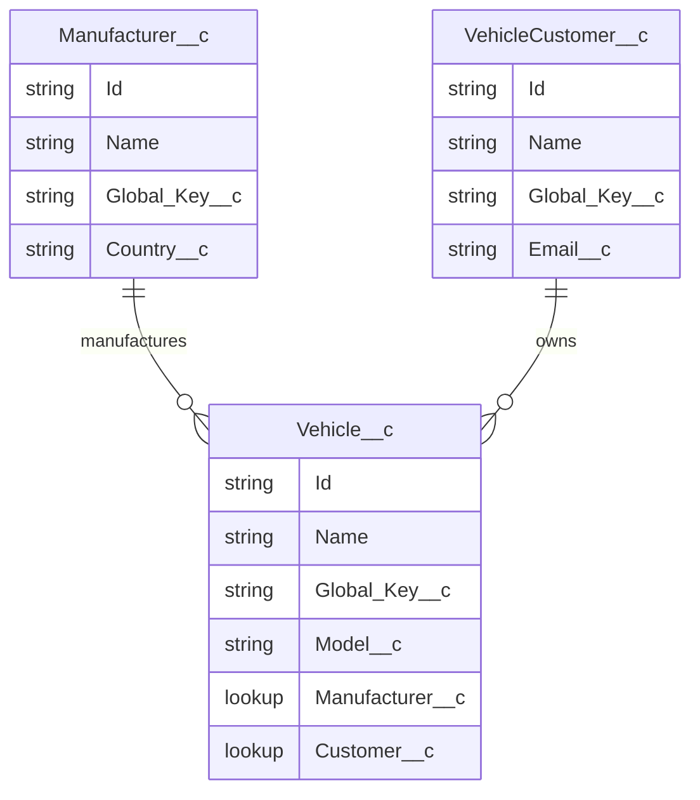

#### Manufacturer__c 
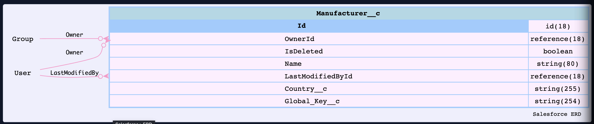


```csv
Global_Key__c,Name,Country__c
MFG-001,Tesla,USA
MFG-002,Toyota,Japan
MFG-003,Ford,USA
```

| Name   | Global_Key__c | Country |
| ------ | ------------- | ------- |
| Tesla  | MFG-001       | USA     |
| Toyota | MFG-002       | Japan   |


#### VehicleCustomer__c 
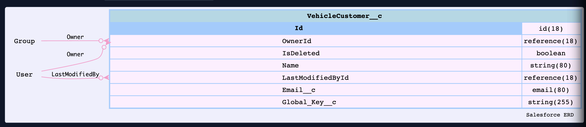

```csv
Global_Key__c,Name,Email__c
CUST-001,John Doe,john@test.com
CUST-002,Jane Smith,jane@test.com
CUST-003,Bob Lee,bob@test.com
```

| Name       | Global_Key__c | Email                                 |
| ---------- | ------------- | ------------------------------------- |
| John Doe   | CUST-001      | [john@test.com](mailto:john@test.com) |
| Jane Smith | CUST-002      | [jane@test.com](mailto:jane@test.com) |
| Bob Lee    | CUST-003      |[jbobe@test.com](mailto:bob@test.com)  |


#### Vehicle__c
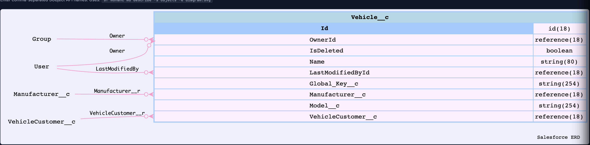

```csv

Global_Key__c,Name,Model__c,Manufacturer__r.Global_Key__c,VehicleCustomer__r.Global_Key__c
VEH-001,Tesla Model S,Model S,MFG-001,CUST-001
VEH-002,Tesla Model X,Model X,MFG-001,CUST-002
VEH-003,Toyota Camry,Camry,MFG-002,CUST-003
VEH-004,Ford Explorer,Explorer,MFG-003,CUST-001

```

----

## Setup

- You need 2 orgs: af102 and af200 in our case

- Make sure both the orgs source-org: af102 and  target-org: af200 have this data model created

- Make sure to populate these 3 objects in source-org af102


## Using SMT

### Make Connection to these 2 orgs

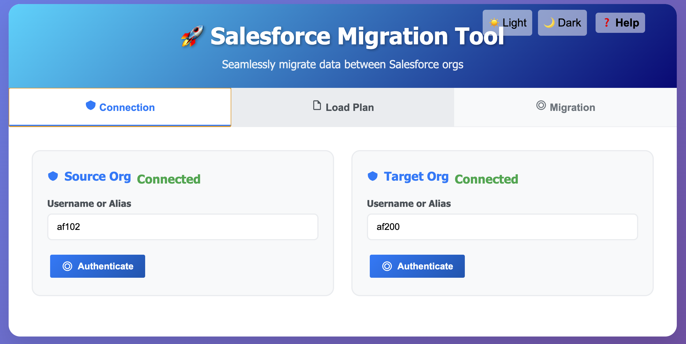

### Load the Load Plan for this use case

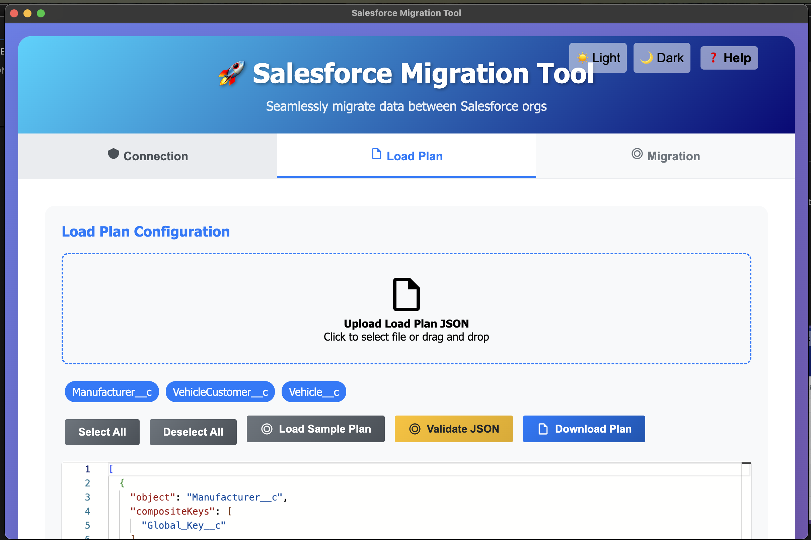


### Data  Migration

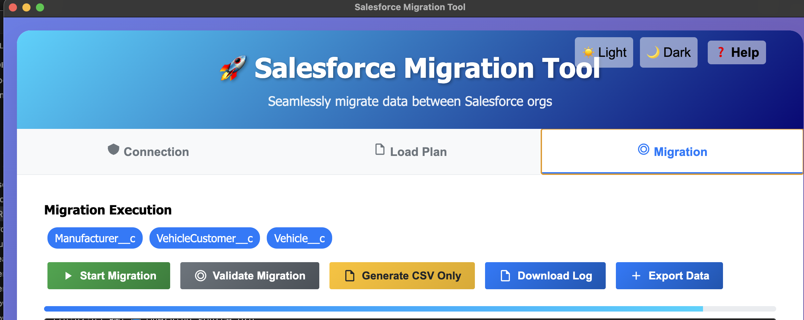

#### Note
- First run **Generate CSV Only** to check the csv creation, for Example: for the object Vehicle__c

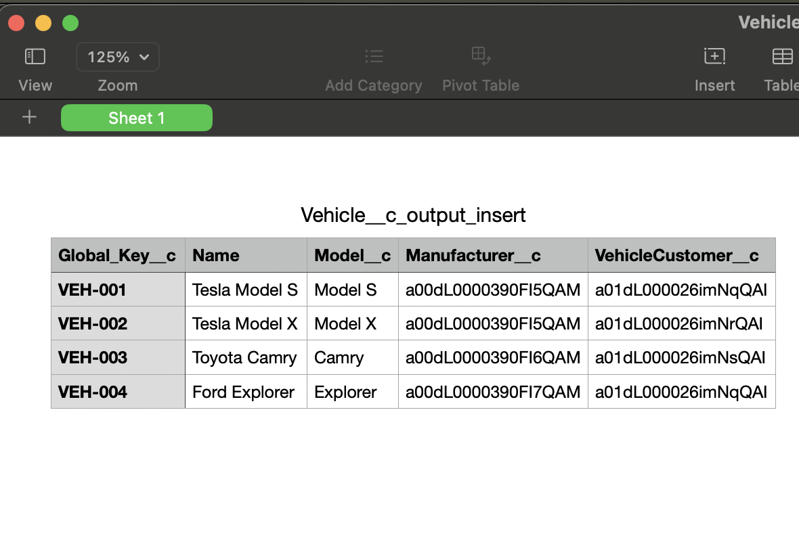 

- Load the objects in the order mentioned in the laod-plan json

- First time SMT will create Inserts for the object

- You can click **Start Migration** to finish the inserts


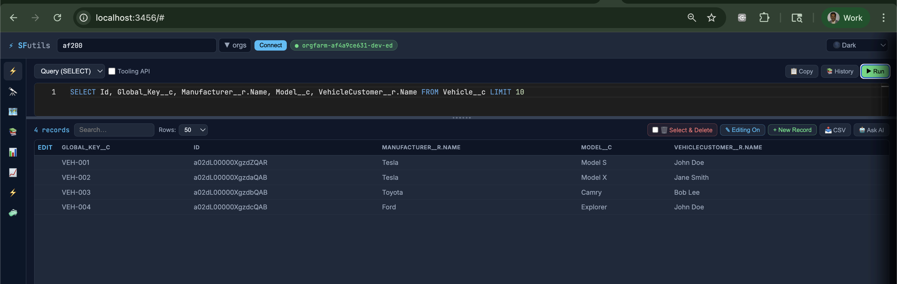

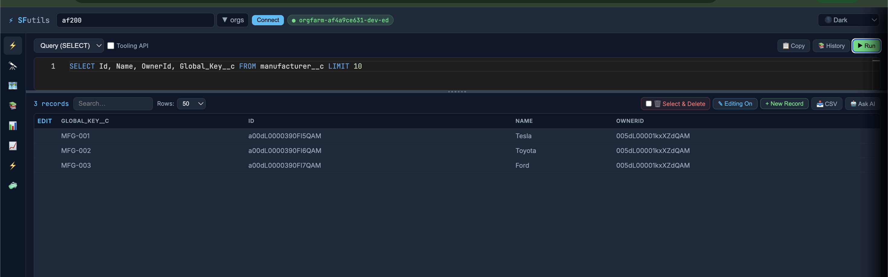


#### Updates

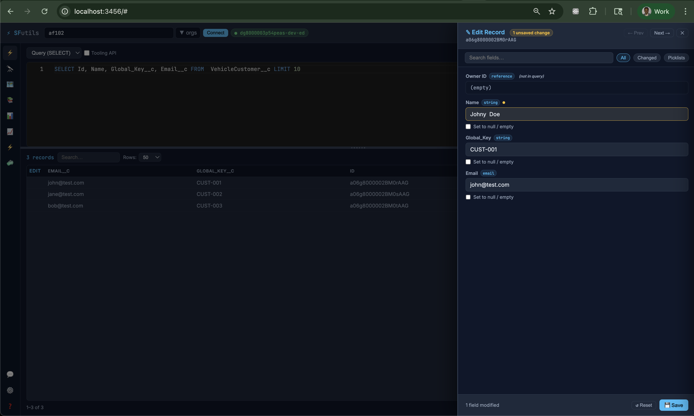

- After update run SMT for the object VehicleCustomer__c
- SMT will update the record(s)


- Clicking **Generate CSV Only**  will provide a CSV :

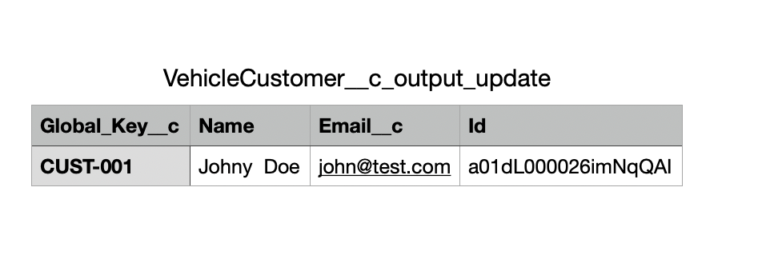

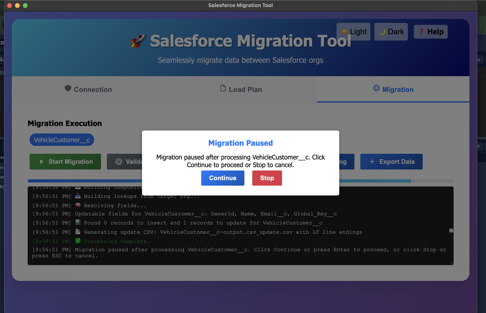

- You can click **Start Migration** to finish this update


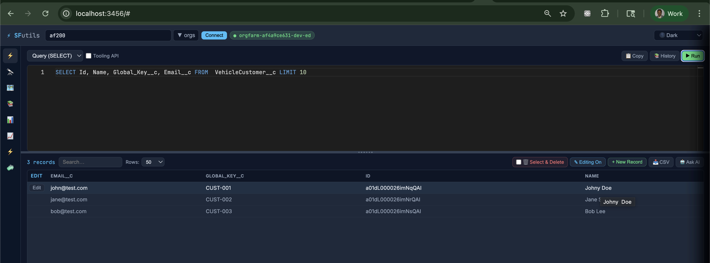

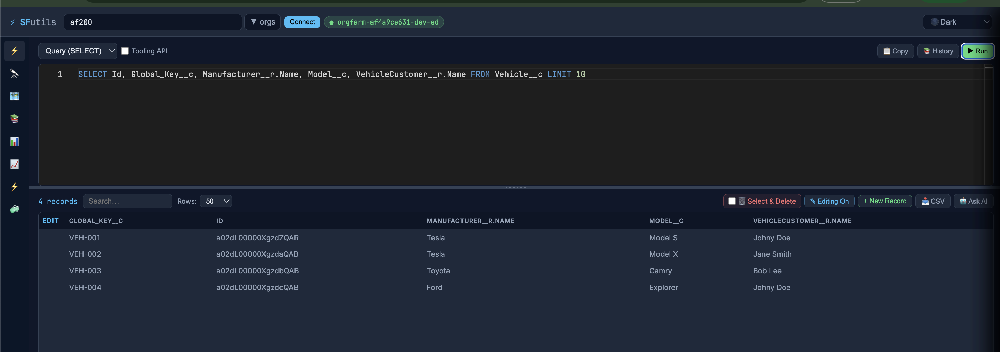


## Compare Tool

- Tool used [sf-data-util](https://www.npmjs.com/package/sf-data-util)

```bash
sf-data-util compare -s af102 -t af200 -l load-plan-vehicle.json -o Vehicle__c

```


### Vehicle__c 
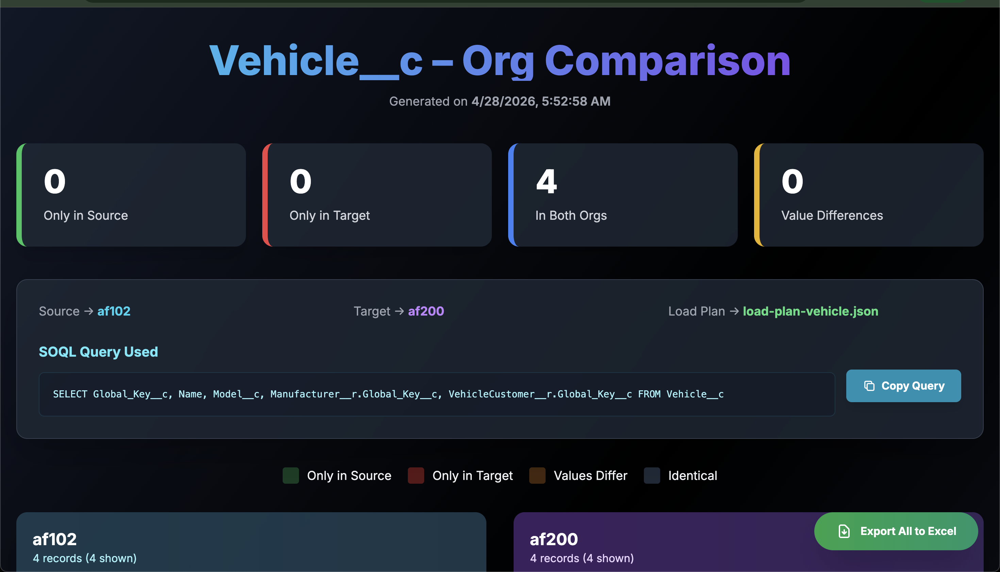
---
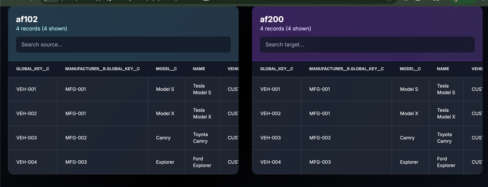
---

### VehicleCustomer__c

```bash
sf-data-util compare -s af102 -t af200 -l load-plan-vehicle.json -o VehicleCustomer__c
```

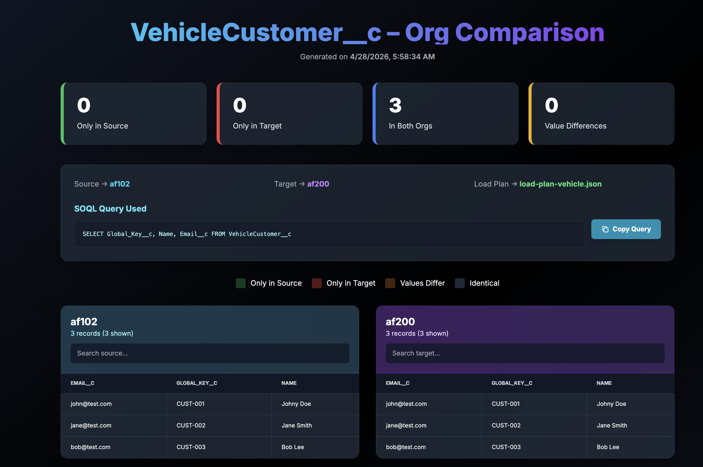

### Manufacturer__c

```bash
sf-data-util compare -s af102 -t af200 -l load-plan-vehicle.json -o Manufacturer__c   
```

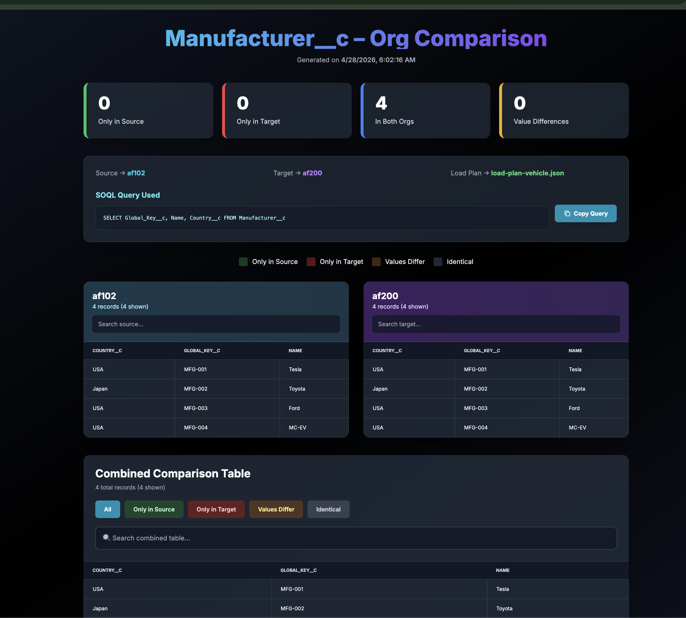


 